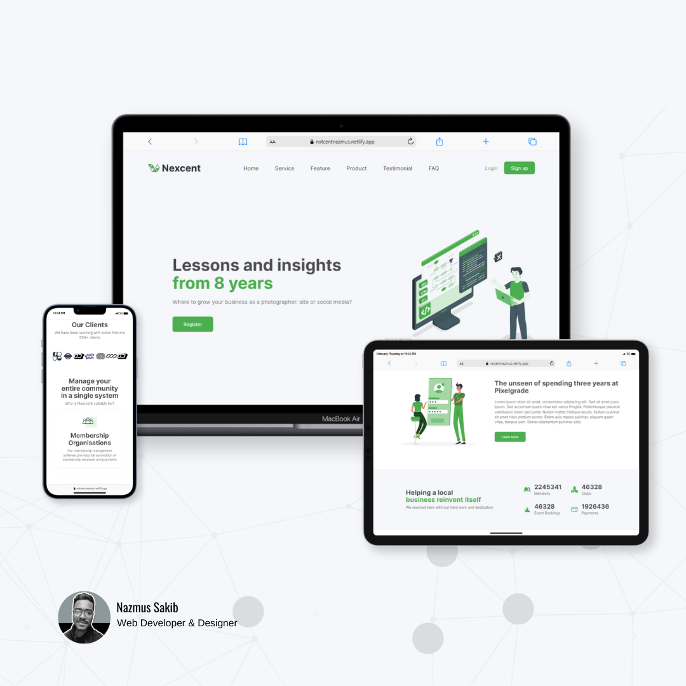

# Brought a Figma community design to life! Check out this website I built and see what I can do for your project.

## Overview

> Welcome! 🧐

This project serves as a showcase of my front-end development skills, featuring a design inspired by the "nextcent" template from the Figma community.

## Demo

Check out the live demo of the website [here](https://nxtcentnazmus.netlify.app).

## Tech Stack

`HTML5`
`SCSS`
`JavaScript (vanilla)`
`Astro js (Framework)`

## Features

- Responsive design - The portfolio is designed to work seamlessly on all devices, from mobile phones to desktop computers and tablets. It provides an excellent user experience regardless.

- Pixel-perfect design - Crafted with meticulous attention to detail, my designs are pixel-perfect, bringing your heart's desires to life with precision and elegance.

- Forget clunky font size jumps! My latest design uses cutting-edge fluid typography that seamlessly adjusts to every screen size, ensuring the website looks amazing on any device, from tiny phones to giant monitors.

## Note: Responsive Design Enhancements
 - Transformed `desktop-only Figma design` into a fully responsive website.

 - Implemented my custom design solutions for optimal user experience across all devices.

### Thanks to
- [Muntasir Billah](https://www.figma.com/@itsmuntasirb) for this excellent design.
